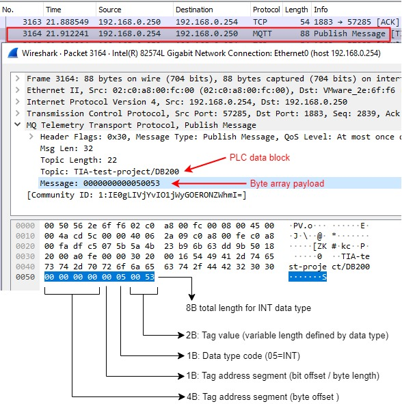

# TIAportal16_MQTT
S7-1500 TIA implementation of byte array MQTT message format for PLC to UNS low volume structured data exchange

A mechanism for integrating data from legacy control systems into a coherent namespace, 
while minimizing the increase in network traffic through parallel data flow.

